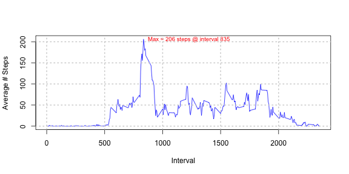
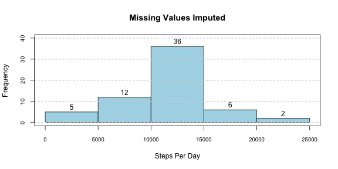

# Reproducible Research: Peer Assessment 1
----  


----   

## Reading and preprocessing the data  
**Rubric:  Is there code to read the data?**   

```r
df <- read.csv(file = "activity.csv"
               , head=TRUE
               , na.strings = "NA"
               )
```
**Rubric:  Is there code to process the data?**  
I want a datetime column...   


```r
df$datetime<-strptime(paste(df$date
                                , " "
                                 , str_sub(paste("0",(60*df$interval%/%100)/60,sep=""),-2,-1)
                                 , ":"           
                                 , str_sub(paste("0",df$interval%%100,sep=""),-2,-1)
                                , ":00"
                                 , sep=""
                           )
                     , "%Y-%m-%d %H:%M:%S"
                     )
df$datetime<- as.POSIXct(strptime(as.character(df$datetime)
                                  , "%Y-%m-%d %H:%M:%S"
                                  )
                         )
```
... and a Weekday/Weekend factor...  


```r
df$weekend <- as.factor(
                        weekdays(df$datetime)=="Saturday"| 
                        weekdays(df$datetime)=="Sunday"
                        )
df$weekend <- ordered(df$weekend,
                     levels = c(TRUE,FALSE),
                     labels = c("Weekend", "Weekday"))
```

Check...  


```r
str(df)
```

```
## 'data.frame':	17568 obs. of  5 variables:
##  $ steps   : int  NA NA NA NA NA NA NA NA NA NA ...
##  $ date    : Factor w/ 61 levels "2012-10-01","2012-10-02",..: 1 1 1 1 1 1 1 1 1 1 ...
##  $ interval: int  0 5 10 15 20 25 30 35 40 45 ...
##  $ datetime: POSIXct, format: "2012-10-01 00:00:00" "2012-10-01 00:05:00" ...
##  $ weekend : Ord.factor w/ 2 levels "Weekend"<"Weekday": 2 2 2 2 2 2 2 2 2 2 ...
```

```r
head(df)
```

```
##   steps       date interval            datetime weekend
## 1    NA 2012-10-01        0 2012-10-01 00:00:00 Weekday
## 2    NA 2012-10-01        5 2012-10-01 00:05:00 Weekday
## 3    NA 2012-10-01       10 2012-10-01 00:10:00 Weekday
## 4    NA 2012-10-01       15 2012-10-01 00:15:00 Weekday
## 5    NA 2012-10-01       20 2012-10-01 00:20:00 Weekday
## 6    NA 2012-10-01       25 2012-10-01 00:25:00 Weekday
```
  
  Looks good - ready to start analysis!  

----  

## What is mean total number of steps taken per day?  
**Rubric:  Is there a histogram and code for the histogram?**  


```r
StepsPerDay <-aggregate(steps~date, data=df, sum, na.rm=TRUE)
hist(StepsPerDay$steps
     , xlab="Steps Per Day"
     , main= "Missing Values Removed"
     , cex.axis=.8
     , labels=TRUE
     , ylim=c(0, 40)
     , col="light blue"
     )
grid(NA,NULL,lwd = 2) 
box()
```

 
Add up the steps for each date...  


```r
StepsPerDay <-aggregate(steps~date, data=df, sum, na.rm=TRUE)
head(StepsPerDay)
```

```
##         date steps
## 1 2012-10-02   126
## 2 2012-10-03 11352
## 3 2012-10-04 12116
## 4 2012-10-05 13294
## 5 2012-10-06 15420
## 6 2012-10-07 11015
```

###Report the mean and median: 
**Rubric:  Are both the mean and median number of steps taken each day reported?**  

```r
mean(StepsPerDay$steps)
```

```
## [1] 10766
```

```r
median(StepsPerDay$steps)
```

```
## [1] 10765
```
  
----  

##What is the average daily activity pattern?  
**Rubric: Is there a time series plot of the average number of steps taken (averaged across all days) versus the 5-minute intervals?**  

```r
AvgStepsPerInterval <- aggregate(steps~interval, data=df,mean,na.rm=TRUE)

MaxPt <-AvgStepsPerInterval[AvgStepsPerInterval$steps==
                                    max(AvgStepsPerInterval$steps),]

plot(  AvgStepsPerInterval$interval
     , AvgStepsPerInterval$steps
     , type='l' 
     , xlab="Interval"
     , ylab= "Average # Steps"
     , col="blue"
    )
text(  MaxPt$interval
     , MaxPt$steps
     , paste("Max =", trunc(MaxPt$steps,0), "steps @ interval", MaxPt$interval)
     , cex = .8
     , pos = 4
     , col = "red"
    )
grid(NULL,NULL,lwd = 2) 
```

 
  
**Rubric: Does the report give the 5-minute interval that, on average, contains the maximum number of steps?**  

Here's the answer: The 5-minute interval containing the maximum number of steps is 835 and the maximum # of steps is 206.1698, as shown below...  


```r
MaxPt
```

```
##     interval steps
## 104      835 206.2
```

----  

## Imputing missing values
Find out how many missing values are in each column of the data...  


```r
summary(df$steps)
```

```
##    Min. 1st Qu.  Median    Mean 3rd Qu.    Max.    NA's 
##     0.0     0.0     0.0    37.4    12.0   806.0    2304
```

### 2. Devise a strategy for filling in all of the missing values in the dataset. 
**Rubric: Does the report *describe* a strategy for imputing missing data?**  

Describe:  My strategy is to replace each missing value with the average # of steps during the same interval from the non-missing rows.  Please see the code chunk below for the calculation.  

NOTE:  I found this code [here](http://stackoverflow.com/questions/9322773/how-to-replace-na-with-mean-by-subset-in-r-impute-with-plyr).   

The new dataset will be named df.imp as shown in the code chunk below.  

**Rubric: Does the report *show with code* a strategy for imputing missing data?**  


```r
impute.mean <- function(x) replace(x, is.na(x), mean(x, na.rm = TRUE))
df.imp <- ddply(df, ~ interval, transform, steps = impute.mean(steps))  
df.imp<-df.imp[order(df.imp$date,df.imp$interval), ] 
```

Now compare the two data frames to verify no more NAs...  


```r
summary(df.imp$steps)
```

```
##    Min. 1st Qu.  Median    Mean 3rd Qu.    Max. 
##     0.0     0.0     0.0    37.4    27.0   806.0
```

```r
summary(df$steps)
```

```
##    Min. 1st Qu.  Median    Mean 3rd Qu.    Max.    NA's 
##     0.0     0.0     0.0    37.4    12.0   806.0    2304
```

Result:  The mean and median were unaffected but the 3rd Quartile increased by 15.  Not at all surprising given the imputation calculation as interval averages.

**Rubric: Does the report contain a histogram of the total number of steps taken each day after missing values were imputed?**  


```r
StepsPerDay.Imp <-aggregate(steps~date, data=df.imp, sum)
hist(  StepsPerDay.Imp$steps
     , xlab = "Steps Per Day"
     , main = "Missing Values Imputed"
     , cex.axis = .8
     , labels = TRUE
     , ylim = c(0, 40)
     , col = "light blue"
     )
grid(NA,NULL,lwd = 2) 
box()
```

 

The histogram is only slightly changed compared to the first one.  

Just for further comparison, I also compared the statistics.  


```r
c(sum(StepsPerDay$steps,na.rm=TRUE),sum(StepsPerDay.Imp$steps,na.rm=TRUE))
```

```
## [1] 570608 656738
```

```r
c(mean(StepsPerDay$steps,na.rm=TRUE),mean(StepsPerDay.Imp$steps,na.rm=TRUE))
```

```
## [1] 10766 10766
```

```r
c(median(StepsPerDay$steps,na.rm=TRUE),median(StepsPerDay.Imp$steps,na.rm=TRUE))
```

```
## [1] 10765 10766
```


## What is the impact of imputing missing data on the estimates of the total daily number of steps?  

**Rubric:  What was the impact of imputing missing values?**

```r
MaxPt.Imp
```

```
##     interval steps
## 104      835 206.2
```

The maximum point stayed the same as before.  Not surprising given the imputation method I chose.  

 ----  
 
## Are there differences in activity patterns between weekdays and weekends?  

### Create a new factor variable in the dataset with two levels – “weekday” and “weekend” indicating whether a given date is a weekday or weekend day. 

**NOTE TO ASSESSOR: The weekend column was created during the pre-processing phase at the top of this page.**  

**Rubric: Does the report contain a panel plot comparing the average number of steps taken per 5-minute interval across weekdays and weekends?**  


```r
AvgStepsPerIntervalWkend.Imp <- aggregate(steps~interval+weekend, data=df.imp,mean)
sp <- ggplot(AvgStepsPerIntervalWkend.Imp, aes(x=interval, y=steps)) + geom_line()+ ylab("Number of Steps")
sp + facet_wrap(~weekend, ncol=1)
```

 


