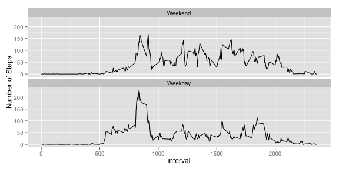

# Reproducible Research: Peer Assessment 1
----  


----   

## Loading and preprocessing the data  
**Rubric:  There is code presented for reading in the dataset**  

```r
df <- read.csv(file = "activity.csv"
               , head=TRUE
               , na.strings = "NA"
               )
```
  
I want a datetime column...   


```r
df$datetime<-strptime(paste(df$date
                                , " "
                                 , str_sub(paste("0",(60*df$interval%/%100)/60,sep=""),-2,-1)
                                 , ":"           
                                 , str_sub(paste("0",df$interval%%100,sep=""),-2,-1)
                                , ":00"
                                 , sep=""
                           )
                     , "%Y-%m-%d %H:%M:%S"
                     )
df$datetime<- as.POSIXct(strptime(as.character(df$datetime)
                                  , "%Y-%m-%d %H:%M:%S"
                                  )
                         )
```
... and I'll need a Weekday/Weekend factor for the last plot...  


```r
df$weekend <- as.factor(
                        weekdays(df$datetime)=="Saturday"| 
                        weekdays(df$datetime)=="Sunday"
                        )
df$weekend <- ordered(df$weekend,
                     levels = c(TRUE,FALSE),
                     labels = c("Weekend", "Weekday"))
```

Check...  


```r
str(df)
```

```
## 'data.frame':	17568 obs. of  5 variables:
##  $ steps   : int  NA NA NA NA NA NA NA NA NA NA ...
##  $ date    : Factor w/ 61 levels "2012-10-01","2012-10-02",..: 1 1 1 1 1 1 1 1 1 1 ...
##  $ interval: int  0 5 10 15 20 25 30 35 40 45 ...
##  $ datetime: POSIXct, format: "2012-10-01 00:00:00" "2012-10-01 00:05:00" ...
##  $ weekend : Ord.factor w/ 2 levels "Weekend"<"Weekday": 2 2 2 2 2 2 2 2 2 2 ...
```

```r
head(df)
```

```
##   steps       date interval            datetime weekend
## 1    NA 2012-10-01        0 2012-10-01 00:00:00 Weekday
## 2    NA 2012-10-01        5 2012-10-01 00:05:00 Weekday
## 3    NA 2012-10-01       10 2012-10-01 00:10:00 Weekday
## 4    NA 2012-10-01       15 2012-10-01 00:15:00 Weekday
## 5    NA 2012-10-01       20 2012-10-01 00:20:00 Weekday
## 6    NA 2012-10-01       25 2012-10-01 00:25:00 Weekday
```

```r
summary(df)
```

```
##      steps               date          interval   
##  Min.   :  0.0   2012-10-01:  288   Min.   :   0  
##  1st Qu.:  0.0   2012-10-02:  288   1st Qu.: 589  
##  Median :  0.0   2012-10-03:  288   Median :1178  
##  Mean   : 37.4   2012-10-04:  288   Mean   :1178  
##  3rd Qu.: 12.0   2012-10-05:  288   3rd Qu.:1766  
##  Max.   :806.0   2012-10-06:  288   Max.   :2355  
##  NA's   :2304    (Other)   :15840                 
##     datetime                      weekend     
##  Min.   :2012-10-01 00:00:00   Weekend: 4608  
##  1st Qu.:2012-10-16 05:58:45   Weekday:12960  
##  Median :2012-10-31 11:57:30                  
##  Mean   :2012-10-31 12:24:00                  
##  3rd Qu.:2012-11-15 17:56:15                  
##  Max.   :2012-11-30 23:55:00                  
## 
```
I see that df$steps has 2,304 missing values (NA's) and none of the other columns have any.  

----  

## What is mean total number of steps taken per day?  
**Rubric: There is a histogram of the total number of steps taken each day**  


```r
StepsPerDay <-aggregate(steps~date, data=df, sum, na.rm=TRUE)
hist(StepsPerDay$steps
     , xlab="Steps Per Day"
     , main= "Rows with Missing Values Not Counted"
     , cex.axis=.8
     , labels=TRUE
     , ylim=c(0, 40)
     , col="light blue"
     )
grid(NA,NULL,lwd = 2) 
box()
```

 
  
  Add up the steps for each date...  


```r
StepsPerDay <-aggregate(steps~date, data=df, sum, na.rm=TRUE)
head(StepsPerDay)
```

```
##         date steps
## 1 2012-10-02   126
## 2 2012-10-03 11352
## 3 2012-10-04 12116
## 4 2012-10-05 13294
## 5 2012-10-06 15420
## 6 2012-10-07 11015
```

**Rubric: Both the mean and median are reported.**  

```r
mean(StepsPerDay$steps)
```

```
## [1] 10766
```

```r
median(StepsPerDay$steps)
```

```
## [1] 10765
```
  
----  

##What is the average daily activity pattern?  
**Rubric: A time series plot is included and it appears correct.**  

```r
AvgStepsPerInterval <- aggregate(steps~interval, data=df,mean,na.rm=TRUE)

MaxPt <-AvgStepsPerInterval[AvgStepsPerInterval$steps==
                                    max(AvgStepsPerInterval$steps),]

plot(  AvgStepsPerInterval$interval
     , AvgStepsPerInterval$steps
     , type='l' 
     , xlab="Interval"
     , ylab= "Average # Steps"
     , col="blue"
    )
text(  MaxPt$interval
     , MaxPt$steps
     , paste("Max =", trunc(MaxPt$steps,0), "steps @ interval", MaxPt$interval)
     , cex = .8
     , pos = 4
     , col = "red"
    )
grid(NULL,NULL,lwd = 2) 
```

 
  
**Rubric: The 5-minute interval containing the maximum number of steps is reported**  

The 5-minute interval containing the maximum **average** number of steps in a five minute interval occurred between 8:30 and 8:35 a.m and was 206 steps, as shown on the plot above and in the snippet below...  


```r
MaxPt
```

```
##     interval steps
## 104      835 206.2
```
  
  Or, just in case I need to report the **absolute** maximum steps in any interval on any day, it was 806 steps between 6:10 and 6:15 a.m. on 11/27/2012 (the instructions were confusing to me so I'm putting both)...  
  

```r
df[which.max(df$steps),]
```

```
##       steps       date interval            datetime weekend
## 16492   806 2012-11-27      615 2012-11-27 06:15:00 Weekday
```

----  

## Imputing missing values
Find out how many missing values are in the data.  I'm just going to find the difference between all rows and complete rows...  


```r
nrow(df)-nrow(df[complete.cases(df),])
```

```
## [1] 2304
```

### 2. Devise a strategy for filling in all of the missing values in the dataset. 
**Rubric: There is a description of a strategy for imputing missing data.**  

Description: I know from my summary(df) done above that the only column with NAs is the steps column. My strategy is to replace each missing value of steps with the average # of steps during the same 5-minute interval from the days non-missing values for that interval.  I could use the median, but I prefer to use the mean.  

Please see the code chunk below for the calculation.  

NOTE:  I found this code on StackOverflow, [here](http://stackoverflow.com/questions/9322773/how-to-replace-na-with-mean-by-subset-in-r-impute-with-plyr).   

The new dataset will be named df.imp as shown in the code chunk below.  

**Rubric: The code for imputing missing data is shown.**  


```r
impute.mean <- function(x) replace(x, is.na(x), mean(x, na.rm = TRUE))
df.imp <- ddply(df, ~ interval, transform, steps = impute.mean(steps))  
df.imp<-df.imp[order(df.imp$date,df.imp$interval), ] 
```

Now compare the two data frames to verify no more NAs (this should give zero)...  


```r
nrow(df.imp)-nrow(df.imp[complete.cases(df.imp),])
```

```
## [1] 0
```
Yes, missing values are gone.  

**Rubric: The histogram is present in the report, using imputed missing values.**  


```r
StepsPerDay.Imp <-aggregate(steps~date, data=df.imp, sum)
hist(  StepsPerDay.Imp$steps
     , xlab = "Steps Per Day"
     , main = "Missing Values Imputed"
     , cex.axis = .8
     , labels = TRUE
     , ylim = c(0, 40)
     , col = "light blue"
     )
grid(NA,NULL,lwd = 2) 
box()
```

 

Observation:  The histogram is slightly changed compared to the first one, with more days falling into the 10-15K bin.  

## What is the impact of imputing missing data on the estimates of the total daily number of steps?  

Just for further comparison, I also compared these statistics.  
1. The totals

```r
c(sum(StepsPerDay$steps,na.rm=TRUE),sum(StepsPerDay.Imp$steps,na.rm=TRUE))
```

```
## [1] 570608 656738
```
The sum of the steps increased due to imputing missing values, as expected.  
2. The averages

```r
c(mean(StepsPerDay$steps,na.rm=TRUE),mean(StepsPerDay.Imp$steps,na.rm=TRUE))
```

```
## [1] 10766 10766
```
No change to the average per day, thanks to imputing using averages.  
3. The medians

```r
c(median(StepsPerDay$steps,na.rm=TRUE),median(StepsPerDay.Imp$steps,na.rm=TRUE))
```

```
## [1] 10765 10766
```
No change to the median steps per day.  
4. The maximums

```r
MaxPt.Imp
```

```
##     interval steps
## 104      835 206.2
```

```r
MaxPt
```

```
##     interval steps
## 104      835 206.2
```

```r
df.imp[which.max(df.imp$steps),]
```

```
##      steps       date interval            datetime weekend
## 4633   806 2012-11-27      615 2012-11-27 06:15:00 Weekday
```

```r
df[which.max(df$steps),]
```

```
##       steps       date interval            datetime weekend
## 16492   806 2012-11-27      615 2012-11-27 06:15:00 Weekday
```
No change to the interval in which the maximum occurred.  

The mean, median and maximum stayed almost exactly the same.  The apparent impact of imputing missing values using interval averages was to add more steps in the middle (10-15K per day) range, as seen on the histogram.  

 ----  
 
## Are there differences in activity patterns between weekdays and weekends?  

**NOTE TO ASSESSOR: The code to create the weekend factor is at top of this page in the preprocessing section.**  

**Rubric: There is a panel plot comparing the average number of steps taken per 5-minute interval across weekdays and weekends. (with missing values imputed.)**  


```r
AvgStepsPerIntervalWkend.Imp <- aggregate(steps~interval+weekend, data=df.imp,mean)
sp <- ggplot(AvgStepsPerIntervalWkend.Imp, aes(x=interval, y=steps)) + geom_line()+ ylab("Number of Steps")
sp + facet_wrap(~weekend, ncol=1)
```

 
Conclusion:  It looks like the person's weekday activity was greater in the mornings, while weekend activity was more spread out throughout the day, on average.   

** Rubric:  The report contains R code for all of the results presented.**  

Dear Peer Assessors, I tried to keep it simple for you by sticking to the rubric.  Please leave a comment if you deducted any points.  Thanks!  

# The End


